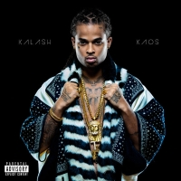

// command line to build up a ionic app smaller and faster
ionic cordova build android --prod --aot --minifyjs --minifycss --optimizejs --release

    // "jsmediatags": "^3.9.2",

<!-- <ion-footer  *ngIf="currentFile.file || true"  [@showHide]="displayFooter">
  <ion-toolbar color="secondary">
    <ion-range min="1" color="dark" [max]="state.durationSec" [formControl]="seekbar" (ionFocus)="onSeekStart()" (ionBlur)="onSeekEnd($event)"
               name="seekbar">
      <ion-label color="light" range-left>{{ state.time }}</ion-label>
      <ion-label color="light" range-right>{{ state.duration }}</ion-label>
    </ion-range>
  </ion-toolbar>
  <ion-toolbar color="light" padding>
    <ion-grid>
      <ion-row align-items-center id="media-controls">
        <!--<button clear ion-col ion-button (click)="previous()">-->
          <!--<ion-icon class="icon ion-shuffle" color="light" name="shuffle"> </ion-icon>-->
        <!--</button>-->
        <button clear ion-col ion-button (click)="previous()">
          <!--<ion-icon color="light" name="skip-backward"> </ion-icon>-->
          
        </button>
        <button clear ion-col ion-button *ngIf="!state.playing" (click)="play()">
          <!--<ion-icon color="light" name="play"></ion-icon>-->
          
        </button>
        <button clear ion-col ion-button *ngIf="!!state.playing" (click)="pause()">
          <!--<ion-icon color="light" name="pause"></ion-icon>-->
          
        </button>
        <button clear ion-col ion-button (click)="next()">
          <!--<ion-icon color="light" name="skip-forward"></ion-icon>-->
          
        </button>
        <!--<button clear ion-col ion-button (click)="onFinishedPlay()">-->
          <!--<ion-icon class="icon ion-sync" color="light" name="sync"></ion-icon>-->
        <!--</button>-->
      </ion-row>
    </ion-grid>
  <!-- </ion-toolbar>
</ion-footer> --> -->

<!-- <now-playing-drawer [options]="drawerOptions">
  <ion-grid style="height: 0px;">
      <ion-row>
        <ng-container>
          <ion-col col-4 col-sm-4 col-md-4 col-lg-4 col-xl-3>
             
          </ion-col>
          <ion-col style="top: -85px;" col-4 col-sm-4 col-md-4 col-lg-4 col-xl-3>
             
          </ion-col>
        </ng-container>
      </ion-row>
  </ion-grid>
<ng-container class="card-background-page" > -->
  <!-- <ion-grid>
    <ion-row>
        <ion-col col-6 class="card-background-page">
            <ion-card  class="music-card palying">
                
     
                  
                

           </ion-card>
        </ion-col>
        <ion-col col-6 class="card-background-page">
          

            
Mode avion

            
Kalash

          

        </ion-col>
    </ion-row>
  </ion-grid> -->
   
    <ion-toolbar *ngIf="currentFile.file || true" >
      <ion-range min="1"  color="dark" [max]="state.durationSec" [formControl]="seekbar" (ionFocus)="onSeekStart()" (ionBlur)="onSeekEnd($event)"
                 name="seekbar">
        <ion-label color="dark" range-left>{{ state.time }}</ion-label>
        <ion-label color="dark" range-right>{{ state.duration }}</ion-label>
      </ion-range>
    </ion-toolbar>
  
    <ion-toolbar padding>
      <ion-grid>
        <ion-row align-items-center id="media-controls">
          <!--<button clear ion-col ion-button (click)="previous()">-->
            <!--<ion-icon class="icon ion-shuffle" color="light" name="shuffle"> </ion-icon>-->
          <!--</button>-->
          <button clear ion-col ion-button (click)="previous()">
            <!--<ion-icon color="light" name="skip-backward"> </ion-icon>-->
            
          </button>
          <button clear ion-col ion-button *ngIf="!state.playing" (click)="play()">
            <!--<ion-icon color="light" name="play"></ion-icon>-->
            
          </button>
          <button clear ion-col ion-button *ngIf="!!state.playing" (click)="pause()">
            <!--<ion-icon color="light" name="pause"></ion-icon>-->
            
          </button>
          <button clear ion-col ion-button (click)="next()">
            <!--<ion-icon color="light" name="skip-forward"></ion-icon>-->
            
          </button>
          <!--<button clear ion-col ion-button (ionChange)="change(this.loop)" >-->
            <!--<ion-icon class="icon ion-sync" *ngIf="this.loop" color="light" name="sync"></ion-icon>-->
            <!--<ion-icon class="icon ion-sync" *ngIf="!this.loop" color="dark" name="sync"></ion-icon>-->
          <!--</button>-->
        </ion-row>
      </ion-grid>
    </ion-toolbar>
  <!-- </ng-container>  

</now-playing-drawer> -->
<!-- 
<ion-col col-3>
              
                </ion-col> -->